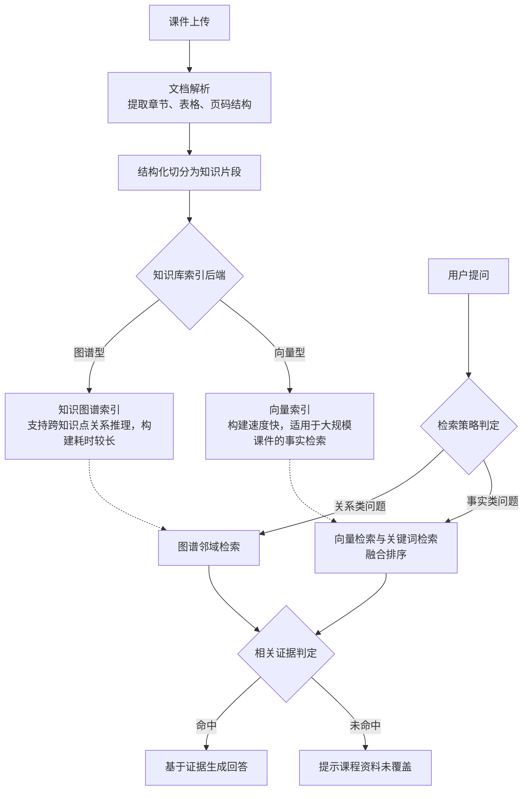

# 《电路分析基础实验》智能体 —— RAG 模块技术汇报

> 本汇报是[电路分析基础实验智能体案例申报稿](电路分析基础实验智能体案例申报稿.md)的技术纵深续篇，聚焦 RAG（检索增强生成）子系统，说明其设计依据、迭代改进过程与量化评测结果。Agent 调度、四大功能、学习记忆等模块见[电路分析基础实验智能体技术汇报（总览）](电路分析基础实验智能体技术汇报（总览）.md)。

---

## 一、问题背景

《电路分析基础实验》课程对回答准确性的要求高于通用问答场景：学生提出的问题（如等效电阻计算、测量误差分析）如果由模型仅凭通用知识回答，容易与任课教师的讲法、教材口径、实验步骤规范产生偏差，甚至给出错误的电路结论。因此 RAG 在本项目中承担三项刚性要求：

1. **证据化**：回答必须可追溯到课程知识库中的具体文档片段，而非模型自由生成。
2. **拒答优先于编造**：知识库未覆盖的问题应明确提示"资料未覆盖"，而不是依赖模型的通用知识强行作答（对应第四节的防幻觉机制）。
3. **索引时效匹配课程规模**：部分课程需要跨知识点的关系推理，部分课程仅需大规模课件下的精确事实检索，二者对索引构建速度与检索能力的要求不同，不能采用单一方案覆盖所有场景。

---

## 二、总体架构

系统按"知识库构建"与"检索问答"两个阶段组织：

文档解析统一将 PDF/DOCX/PPTX 转换为带章节、页码元数据的结构化文档；切分策略按知识库配置的索引后端分发，两种后端共享同一套解析与切分逻辑，仅在"如何将切分结果构建为可检索索引"这一步产生分叉。这一设计的直接效果是：后续若需接入新的索引方案，改动范围只限于索引与检索模块，不影响文档解析与切分链路。

---

## 三、核心设计决策

### 3.1 双索引后端：知识图谱与向量索引的取舍

系统支持按知识库选择索引后端：

| 后端 | 索引原理 | 构建速度 | 检索能力 |
|---|---|---|---|
| 知识图谱索引（默认） | 逐文本块调用大模型抽取实体与关系，构建知识图谱 | 较慢，大规模课件需数小时 | 支持跨知识点的多跳关系推理 |
| 向量索引 | 复用已切分的文本块，仅进行向量编码 | 较快，分钟级完成 | 适用于精确事实检索，不具备关系推理能力 |

知识图谱式检索能够支持"两个定理之间有何联系"一类跨知识点问题，但构建成本随课件规模线性增长，大规模课件场景下会成为部署瓶颈；而多数课程的问答需求本质是"定位某一知识点的原文表述"，无需图谱推理能力。基于此，系统按课程规模与教学需求的差异化，允许每个知识库独立选择索引后端，而非强制统一方案。

向量存储层选用 PostgreSQL 的向量扩展（pgvector），而非引入独立的专用向量数据库。该选择基于两点考虑：其一，pgvector 的近似最近邻检索（HNSW 索引）在千万级向量规模内已具备足够的检索性能；其二，复用现有数据库实例可避免额外引入运维成本，这一权衡对高校实验室的部署场景更为适配。

### 3.2 混合检索与排序融合

向量检索（基于语义相似度的稠密检索）与关键词检索（基于全文索引的稀疏检索）各有互补的适用范围：前者能够跨越表述差异定位语义相关内容，后者对专有名词、型号等精确词汇的召回更可靠。系统对两类检索结果分别独立查询，再通过融合排序策略合并为最终结果。

融合策略未采用向量存储组件自带的默认混合模式，原因是该默认实现仅做简单的去重合并，未实现真正的排序融合，且其权重参数在实际运行中不生效（已有社区讨论确认此为已知问题）。系统改用倒数排名融合（Reciprocal Rank Fusion，RRF）方法替代：该方法仅依据两路结果各自的排名位置计算融合得分，不依赖两套检索分数在量纲上的可比性，是信息检索领域的经典融合方法，在近期的多路检索融合研究中也被验证能带来稳定的效果提升。由于向量检索与关键词检索面向同一存储表，两路结果的片段标识天然一致，融合过程无需额外的跨存储对齐步骤。

### 3.3 结构化文档切分

原有切分方案按固定字数机械切分文档，未考虑文档的标题层级与表格结构，导致大段表格被从中间截断、上下文完整性受损。改进后的切分方案引入标题层级栈结构，按文档的章节层级切分，并将表格作为独立单元整体保留；切分粒度也从固定较大值调整为更小的可配置值，配合上下文摘要前缀（为每个片段补充其在原文中的位置与主题背景）弥补切分粒度变小后可能丢失的上下文信息。PDF 文档的结构化解析进一步引入了版面分析与表格结构识别能力，取代此前仅按页面顺序提取文本、不区分表格与栏位的处理方式。这一系列改进的效果见第五节的对照实验数据。

---

## 四、防幻觉机制

检索召回结果进入回答生成环节之前，系统设置了三层判定，用于避免"未检索到相关证据仍被当作证据使用"的情况：

1. **无命中判定**：检索环节返回空结果时，系统在生成回答之前统一拦截该信号。LightRAG 后端无命中时返回固定的兜底字符串，由单一汇聚点匹配标记拦截（覆盖其全部调用路径）；pgvector 后端无命中即返回空列表，直接进入后续拒答。
2. **相关性阈值过滤**：检索到的片段会经过相关性重排序，得分低于设定阈值的片段在进入生成环节前被剔除（默认阈值为不过滤，保持向后兼容）。该层默认关闭，仅在开启精排且拿到重排序分数时生效；因交叉编码器分数跨问题不可比，阈值须在本课程含超纲问题的数据上标定后方可启用。
3. **工具层显式拒答信号**：当最终可用证据为空时，系统向上层返回明确的"未命中"状态，同时不附带任何来源引用，使回答环节转为提示"课程资料未覆盖该问题"，而非依赖模型的通用知识生成一个可能有误的结论。

三层判定构成冗余设计：无命中判定与工具层拒答始终生效，相关性阈值层默认关闭、需精排开启后方介入，故任一层因配置原因未生效时其余层仍可兜底。这一机制是针对"实验教学场景不允许输出错误结论"这一具体风险设计的，而非通用 RAG 系统的默认做法。

---

## 五、迭代改进历程

### 5.1 索引存储方案的演进

早期的向量索引实现未指定专用的向量存储组件，检索时采用无索引加速的线性扫描；索引数据以文件形式持久化在本地磁盘，每个服务进程各自将全量索引加载至内存常驻；索引文件与数据库中的业务数据分属两套独立存储，一致性与备份需分别处理。该实现还配有一套独立的管理接口，与主问答链路基本脱节，实际未接入教学场景使用。

改进后的方案将向量存储迁移至数据库层的向量扩展，索引数据与业务数据统一存储，并按知识库配置接入统一的检索路由，不再是脱节的旁路系统。

> 该重构目前处于开发验证阶段，尚未合并至主分支，本汇报按当前实现描述，后续将随代码合并同步更新评测结果。

### 5.2 切分方案改进的对照实验

针对第 3.3 节所述的切分方案改进，项目在同一课程、相同原始文档的条件下开展了严格控制变量的对照实验，仅切分方式为变量，以标准评测指标（检索精确率、检索召回率、回答忠实度）在评测集上进行对比：

| 指标 | 改进前 | 改进后 | 变化 |
|---|---|---|---|
| 检索精确率 | 0.952 | 0.952 | 持平 |
| 检索召回率 | 0.646 | 0.743 | +0.097（约 +15%） |
| 回答忠实度 | 0.661 | 0.704 | +0.043（约 +6.4%） |

改进后的召回率分布同样更为集中（中位数由 0.667 提升至 0.833，标准差由 0.346 降至 0.309），说明提升并非由少数高分样本拉高均值，而是整体样本表现更稳定。该实验过程中还修复了一处影响对照有效性的评测缓存隔离问题，并补充了回归测试以保证该问题不再复现。

后续补充实验还观察到：知识图谱检索路径的召回率高于同期向量检索基线，说明图谱邻域扩展能够补充纯向量检索遗漏的信息，为不同课程场景下的索引后端选型提供了实测依据。

### 5.3 评测结果的持续优化

最新一轮评测在同一天内的两次迭代对比显示，回答忠实度由 0.8812 提升至 0.8962，检索召回率由 0.8389 提升至 0.8722，检索精确率保持 1.0 不变，说明优化过程具有持续性与可复现性，而非单次评测的随机波动。

---

## 六、量化效果评价

### 6.1 评测方法

评测方法基于 RAGAS 评测框架，并针对本项目场景做了三点定制：其一，评测流程将"检索证据获取"与"回答生成"拆分为两个独立步骤采集，避免回答内容反向影响忠实度指标的有效性；其二，评测指标按检索层、生成层、鲁棒性与领域定制层分级组织，其中教学表述准确性与实验安全提示是专门为教学场景定制的指标；其三，评测集由人工编写的电路实验题构成，按认知维度划分为事实类、关联类、推理类、比较类四种题型，用于区分系统在不同认知复杂度问题上的表现差异。评测流程还设置了质量门禁阈值，用于在后续迭代中及时发现检索质量的退化。

### 6.2 最新评测结果

在人工编写的 30 道电路实验题上，采用向量检索策略的评测结果如下：

**总体指标**

| 指标 | 分数 | 质量门禁 | 是否达标 |
|---|---|---|---|
| 回答忠实度 | 0.8962 | ≥0.85 | 达标 |
| 检索精确率 | 1.0000 | ≥0.80 | 达标 |
| 检索召回率 | 0.8722 | ≥0.75 | 达标 |

**按认知维度拆解**

| 题型 | 回答忠实度 | 检索精确率 | 检索召回率 |
|---|---|---|---|
| 事实类 | 1.000 | 1.000 | 1.000 |
| 关联类 | 0.917 | 1.000 | 0.917 |
| 比较类 | 0.913 | 1.000 | 0.917 |
| 推理类 | 0.759 | 1.000 | 0.667 |

检索精确率已接近完美，说明召回的内容基本不含噪声；事实类问题的忠实度与召回率均达到满分；推理类问题仍是当前最明显的短板，个别题目表现明显偏低，这与推理类问题往往需要跨越多个知识点完成因果链条串联、而当前检索策略仅进行单点检索的能力边界相符。

---

## 七、局限与下一步计划

1. **推理类问答仍是当前最明确的短板**。初步归因方向是当前向量检索策略缺乏多跳推理能力，而具备图谱邻域扩展能力的检索策略尚未在本轮评测集上系统对比，下一步计划将其纳入同一评测集进行对比验证。
2. **双索引后端重构目前尚未合并至主分支**，尚未经过完整的评测验证，需要在合并前补充针对新索引方案的检索质量评测。
3. **切分粒度的系统性消融实验尚未完成**，当前取值是基于首轮实验确定的候选值，仍需与其他候选值做系统对比以确认是否最优。

---

## 附：关键代码位置

| 主题 | 位置 |
|---|---|
| 核心类型定义 | `backend/core/rag/types.py` |
| 组件工厂 | `backend/core/rag/registry.py` |
| 文档摄入与切分分发 | `backend/core/rag/ingestion.py` |
| 结构化切分（DOCX/PDF） | `backend/core/rag/chunking/`、`backend/core/rag/llamaindex/file_routing.py` |
| 索引器与检索器实现 | `backend/core/rag/indexer/`、`backend/core/rag/retriever/` |
| 向量存储封装 | `backend/core/rag/llamaindex/pg_store.py` |
| 混合检索融合逻辑 | `backend/core/rag/hybrid_retriever.py` |
| 检索路由与防幻觉门控 | `backend/core/agent/tool_registry.py`（工具层拒答）、`backend/core/rag/hybrid_retriever.py`（pg 阈值层）、`backend/core/rag/lightrag/instance_pool.py`（LightRAG 阈值层） |
| 评测框架 | `backend/scripts/eval_rag/` |
| 切分改进对照实验记录 | `backend/docs/RAG_CHUNKING_EVAL.md` |
| 最新评测报告 | `backend/scripts/eval_rag/results/eval_report_20260728_080439.md` |

## 参考依据

- Es, S. et al. (2023). *RAGAS: Automated Evaluation of Retrieval Augmented Generation*. arXiv:2309.15217.
- Cormack, G. V., Clarke, C. L. A., & Buettcher, S. (2009). *Reciprocal Rank Fusion outperforms Condorcet and individual Rank Learning Methods*. SIGIR 2009.
- NAACL Findings 2025, *MMLF: Multi-query Multi-passage Late Fusion Retrieval*.
- MultiDocFusion, arXiv:2604.12352 —— 层级感知切分对检索精度的提升依据。
- Docling, arXiv:2408.09869；OmniDocBench, CVPR 2025 —— 文档结构化解析与表格识别依据。
- Anthropic, *Contextual Retrieval*（技术报告）—— 上下文摘要前缀降低检索失败率的依据。
- Malkov, Y. A., & Yashunin, D. A. —— HNSW 近似最近邻算法。
- RAGFlow（开源项目）—— 结构化文档切分思路的参考来源。
