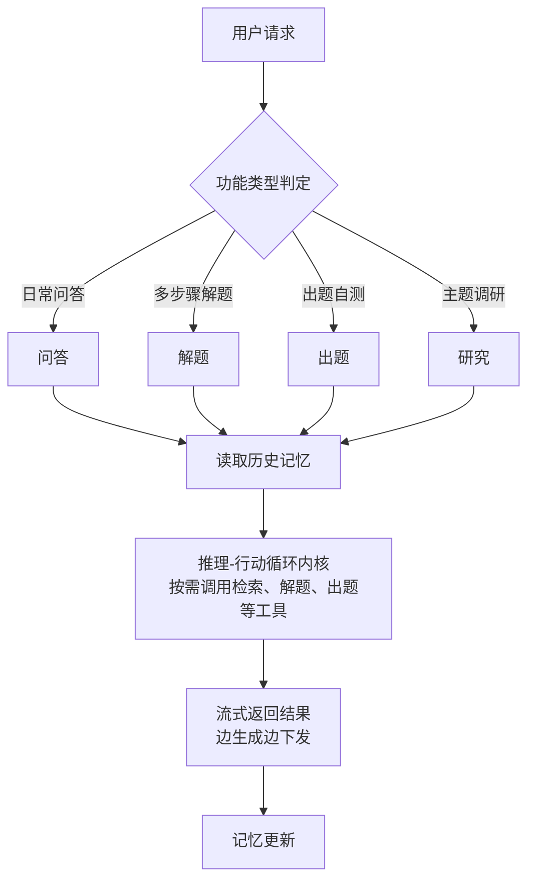
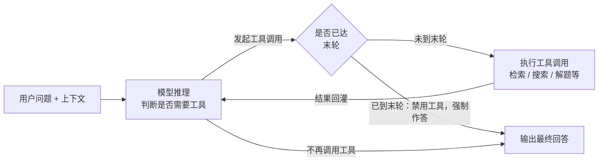
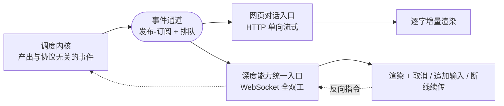
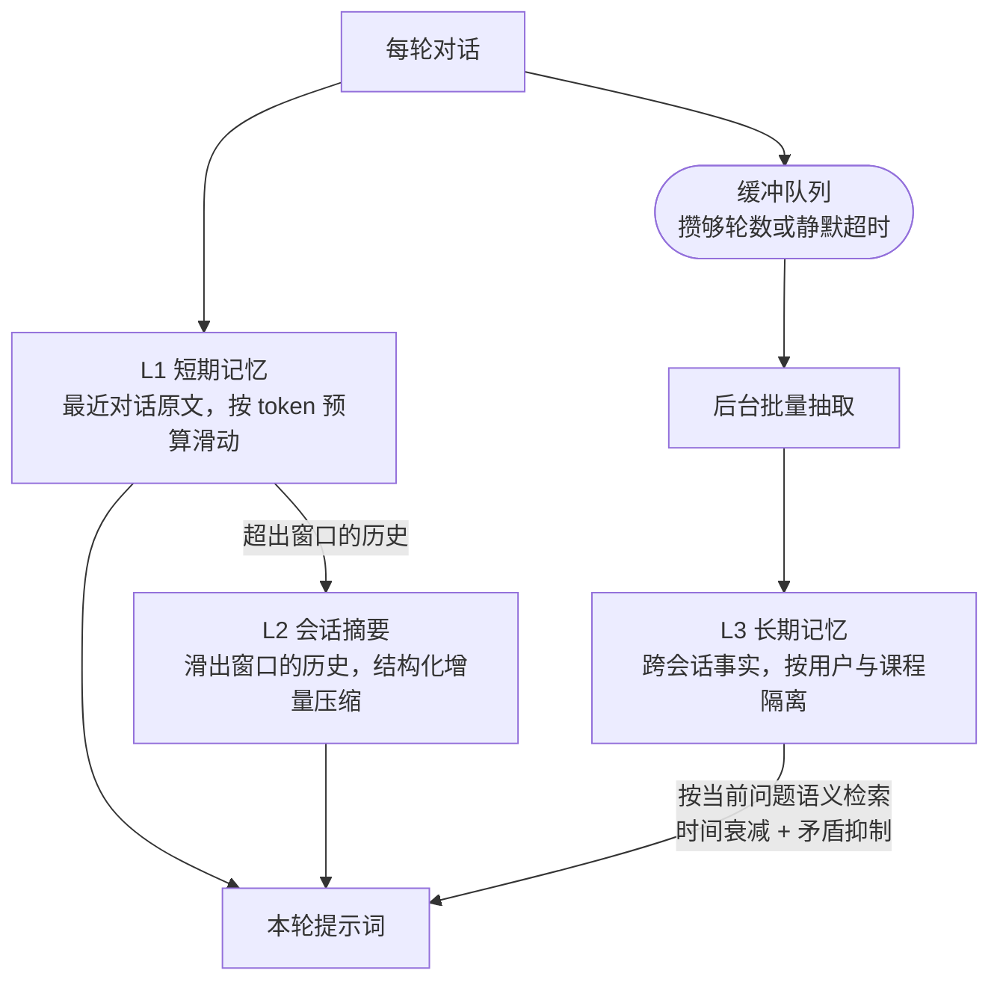
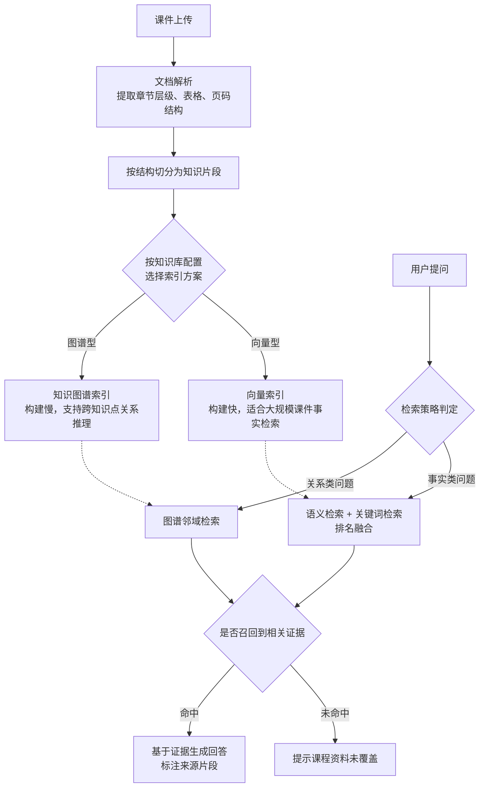

# 课程助手智能体 —— 技术汇报与部署选型（总览）

> 本篇覆盖 Agent 调度、四大功能、学习记忆、RAG 检索、工程管理五个部分。

---

## 整体架构

系统的处理流程为：用户请求进入后，先由调度层确定本次请求对应的功能类型，再统一进入一套共享的推理-行动循环内核(agent loop)；循环执行过程中会读取该用户的历史记忆作为上下文补充，执行结束后将本次交互的信息更新写回记忆存储。

四种功能共享同一套调度内核，区别仅在于各自配置的工具集合与执行阶段划分。这一架构选择的直接收益是：内核层的可靠性改进（如超时处理、异常兜底）对四种功能同时生效，避免维护多套重复逻辑。

---

## 一、Agent 调度内核

系统采用工具调用（tool call）驱动的推理-行动循环机制（ReAct）：模型在每一轮自行判断是否需要调用工具（如检索课程资料、联网搜索），需要则执行调用并将结果回灌给模型，模型据此决定继续调用还是给出最终回答；当模型不再发起任何工具调用时，本轮循环结束并输出结果。循环设有轮次上限，且最后一轮强制不再提供工具调用能力，确保用户必然获得文本回答。

该机制与学术界提出的推理-行动交替范式（Reasoning and Acting，简称 ReAct）思路一致，区别在于工具调用的方式采用主流大模型厂商原生支持的结构化调用接口，而非要求模型在文本中按约定格式输出调用意图——前者由厂商保证格式正确性，可靠性更高，也更容易在不同模型供应商之间迁移。

调度内核在设计上包含以下几项考虑：

- **强制收尾**：循环的最后一轮禁用工具调用能力，保证用户始终能获得文本回答。
- **轮次上限**：循环设置最大迭代次数，避免模型持续调用工具导致的响应延迟或逻辑发散。
- **工具（skill）描述的按需渐进加载**：系统提示中默认仅提供工具的简要索引，模型需要使用某项能力扩展说明时再行加载，避免上下文长度因大量工具描述而膨胀。
- **模型供应商的动态切换**：系统支持在请求级别动态指定所使用的模型供应商与模型版本，调度内核本身无需为支持多供应商而调整实现，配置变更后即时生效，无需重启服务。
- **异常兜底**：模型未产生任何有效回答内容时，系统提供固定的兜底提示，避免向用户返回空白结果。

与业界常见的图编排类调度框架（以显式状态图定义流程走向）相比，本系统的流程控制主要通过代码层面的编排与轮次限制实现，未引入独立的图运行时；这一选择在保证核心逻辑可追溯、可测试的前提下降低了实现复杂度，适配当前功能规模。

### 1.1 执行内核与传输协议解耦

调度内核在执行一次任务的过程中，对外只产生一串与传输方式无关的事件（阶段起止、模型增量输出、工具调用状态、最终答案等），不关心这些事件最终经由何种协议、以何种形式送达客户端。

内核与各协议入口之间通过一个发布-订阅式的事件通道连接，而非直接函数调用：内核只负责按顺序产出事件，产出后立即返回，不等待、也不关心任何消费方是否已经处理完毕；各协议入口则各自按自己的节奏订阅、拉取。这一异步机制带来两点收益：一是模型推理与事件下发可以并行推进——内核一边推理一边产出事件，各入口一边接收一边转发给客户端，而不必等整个任务跑完再统一打包返回，这是实现首字延迟最短、逐字流式渲染的前提；二是当内核产出速度与某个消费端的处理或网络速度不一致时（例如模型产出快于前端渲染，或客户端网络抖动导致消费暂时停滞），事件在通道中排队等待即可，不会因为某一个消费方变慢而拖慢或阻塞内核本身的执行。

同一套事件流目前由两类协议入口消费，二者的差异不止编码格式，还包括是否承载反向指令：

- **网页对话入口**：采用 HTTP 单向流式响应，将事件逐条按行下发，客户端据此做逐字增量渲染，追求首字延迟最短；由于该协议单向、不承载客户端的中途指令，网页对话还需要一条独立于事件流之外的旁路，供用户点击"立即作答"时中断工具调用循环。
- **深度能力统一入口**（出题、研究共用）：采用全双工协议（WebSocket），除下发事件外，还需要在同一连接上支持用户对模型的澄清反问进行实时交互、接收客户端主动发来的取消任务与追加输入等指令，并支持断线重连后按事件序号续传——这些能力是单向协议无法提供的。

两类入口共享同一套任务执行与事件产出逻辑，区别仅在于各自如何解读、缓冲与转发这些事件。若不做这层解耦，则要么为两种协议各自重复实现一遍任务编排与工具调用逻辑，要么让执行内核直接绑定某一种协议的语义，届时另一类入口将无法复用。

### 1.2 提示词拼装顺序与前缀缓存

系统提示词由若干来源拼接而成：固定的执行规范、课程级配置、技能说明、工具提示、跨会话记忆、当前时间等。拼接顺序并非按内容主题分组，而是按"跨请求的稳定程度"从高到低排列——全局恒定不变的部分放最前，同课程或同用户在连续多轮内基本不变的部分次之，逐次请求都可能变化的部分（检索到的记忆、当前时间等）放在最后；这一顺序服务于主流大模型供应商提供的前缀缓存机制：只要多次请求的提示词前缀逐字符一致，供应商侧即可命中已缓存的中间计算结果，跳过该前缀部分的重复推理，只需处理新增内容，从而降低首字延迟，并减少按输入 token 计费的用量。

---

## 二、四大功能

系统面向用户提供四类功能入口，由前端指定：

| 功能 | 定位 | 执行方式 |
|---|---|---|
| 问答 | 面向课程内容的多轮交互问答，回答优先基于检索到的课程资料 | 单次循环执行，按需调用检索、联网搜索等工具 |
| 解题 | 面向需要多步骤推导的问题，要求先给出完整计划再逐步执行 | 单次循环配合专门的计划状态记录机制 |
| 出题 | 按要求自动生成练习题目 | 分阶段执行：素材检索、出题蓝图规划、题目并行生成 |
| 研究 | 面向指定主题的深入调研，产出附带引用来源的报告 | 分阶段执行：主题澄清、子问题拆分、并行检索取证、报告生成 |

四类功能均建立在同一套调度内核之上，区别在于任务编排方式：问答任务采用单次循环即可完成；解题任务在单次循环基础上引入了额外的状态记录机制，用于约束"先规划、再执行、不可跳步"的过程；出题与研究任务则将任务拆分为多个阶段，每个阶段分别执行一次或多次循环，再将各阶段结果整合为最终输出。

### 2.1 解题任务

解题任务的可靠性依赖于一个独立于模型推理的状态记录机制：模型必须先完整给出解题计划，计划确认后按步骤逐一推进，每完成一步才能进入下一步；若执行中出现偏差，允许重新规划，但重新规划的次数受到上限约束。这一设计将"计划完整性"与"不可跳步"两项要求实现为可验证的执行约束，而非仅依赖提示词层面的建议，可靠性更高，也具备可测试性。

### 2.2 出题任务

出题任务采用三阶段流程：首先从课程资料中检索相关内容，其次生成出题蓝图（确定题目数量与各题的题型），最后按蓝图并行生成各道题目。将"确定蓝图"与"逐题生成"分离，并允许题目之间并行处理，能够避免生成过程中出现题型与数量偏离蓝图的情况，同时降低整体生成耗时；单道题目生成失败也不会影响其余题目的正常产出。

### 2.3 研究任务

研究任务采用四阶段流程：主题澄清、子问题拆分、并行检索取证、报告撰写，各阶段的行为规范通过提示词工程分别约束，提示词与代码分离、可独立调整。子问题之间的检索过程相互独立，可并行执行；每一条纳入报告的结论都要求关联具体的检索来源，最终报告以编号形式标注引用出处，保证结论可追溯，避免出现缺乏依据的论断。

---

## 三、学习记忆系统

系统采用分层记忆结构，支持跨对话轮次与跨会话的个性化交互，三层分别针对不同的遗忘边界与更新代价采用了不同的维护策略。

三层的写入代价依次递增：短期记忆只是窗口裁剪，无额外开销；会话摘要按间隔触发一次模型调用；长期记忆则把多轮合并为一次抽取放到后台执行，完全不占用当轮响应时间。

### 3.1 L1 短期记忆：按 token 预算动态伸缩的滑动窗口

短期记忆保留的不是固定"最近 N 轮"，而是按目标模型的上下文窗口换算出一个 token 预算，从最新消息开始向前逐条累加所占 token 数，一旦累计超出预算即停止继续向前追溯纳入窗口，窗口长度随所选模型的上下文容量自适应伸缩。token 计数优先使用分词器精确统计，分词器不可用时退化为按字符数估算，保证该环节始终可用。

### 3.2 L2 会话摘要：增量结构化压缩，而非重复重写全量摘要

当会话消息数超出短期记忆窗口（context window）一定量后，触发对窗口之外的历史消息做摘要压缩，用于在原文滑出窗口后仍保留其中的关键信息。压缩以增量方式进行：维护一个按消息时间戳与 ID 复合排序的游标，记录已压缩到的消息位置，每轮只处理游标之后、窗口边界之前新增的这一小段历史，不重复扫描或重新处理已压缩过的部分。每次做摘要时只让大模型从新增的历史片段中按预定义结构（讨论主题、已达成结论、确认的事实、未解决问题、后续约定）抽取信息、输出为结构化数据，旧摘要仅作参考避免重复抽取，最终由确定性的代码逻辑将新抽取结果与已有摘要做归一化去重合并，每类信息按条数上限保留最近若干项、超出上限时丢弃最旧的一项；抽取结构化失败时降级为自由文本融合，保证链路不中断。同时设置压缩触发间隔，避免每轮对话都触发一次 LLM 调用。压缩任务按会话维度加锁（进程内锁 + 可选跨进程锁），并在数据库写回时做乐观并发控制（版本号校验后条件更新），防止同一会话被并发触发多次压缩导致摘要游标错乱与增量丢失。

### 3.3 L3 长期记忆：批量沉淀、课程隔离与检索增强

长期记忆跨会话保留关于用户的离散事实（学习偏好、薄弱知识点等），沉淀与检索各自做了针对性设计。

沉淀链路：单轮对话结束后不立即调用大模型抽取，而是先写入按用户与会话分桶的缓冲队列，写入方只做入队与消息过滤，不含任何抽取逻辑。后台任务按两个条件之一触发批量处理：累积轮数达到阈值，或最近一次写入后静默超过设定时长。触发后一次性把多轮对话喂给记忆抽取算法，由其识别原子事实并逐条判定新增、合并更新、因矛盾废弃还是重复跳过——该判定复用成熟开源记忆库 mem0 的既有实现。

检索增强：语义检索之外叠加两点。一是排序阶段引入时间衰减，按记忆新旧对相关度加权，避免久远但语义相似的记忆压过更新的记忆；二是矛盾记忆抑制，对文本相似度超阈值且写入时间相隔超过最小天数的两条记忆，判定为同一事实的前后版本，注入时只保留较新的一条——该判定基于字符串相似度计算完成，不额外消耗大模型调用。

---

## 四、RAG 检索

实验类课程对回答准确性的要求高于通用问答：学生提出的问题若由模型仅凭通用知识作答，容易与任课教师的讲法、教材口径、实验步骤规范产生偏差。因此本系统的检索子系统承担三项刚性要求——回答须可追溯到课程资料中的具体片段；资料未覆盖时明确拒答而非用通用知识强答；索引方案须匹配不同课程在规模与推理需求上的差异。

整体流程分为"知识库构建"与"检索问答"两个阶段：

文档解析统一将 PDF、DOCX、PPTX 转换为带章节与页码元数据的结构化文档。

### 4.1 结构化切分与对照实验

原有切分方案按固定字数机械切分，不考虑标题层级与表格结构，导致大段表格被从中间截断、片段脱离所属章节语境。改进后的方案引入标题层级栈，按文档自身的章节层级切分，并将表格作为独立单元整体保留；切分粒度由固定较大值调整为更小的可配置值，同时为每个片段补充上下文摘要前缀（说明该片段在原文中的位置与主题背景），以弥补粒度变小后可能丢失的语境。PDF 的解析进一步引入mineru进行版面分析与表格结构识别，取代此前仅按页面顺序提取文本、不区分表格与栏位的做法。

项目在同一课程、相同原始文档、仅切分方式为变量的条件下开展了对照实验，基于 RAGAS 评测框架，在人工编写的评测集上对比标准指标：

| 指标       | 改进前 | 改进后 | 变化               |
| ---------- | ------ | ------ | ------------------ |
| 检索精确率 | 0.952  | 0.952  | 持平               |
| 检索召回率 | 0.646  | 0.743  | +0.097（约 +15%）  |
| 回答忠实度 | 0.661  | 0.704  | +0.043（约 +6.4%） |

改进后召回率的分布也更集中（中位数由 0.667 升至 0.833，标准差由 0.346 降至 0.309），说明提升来自整体样本表现的改善，而非少数高分样本拉高均值。

### 4.2 双索引方案

部分课程需要回答"两个定理之间有何联系"这类跨知识点问题，部分课程的问答需求本质只是"定位某一知识点的原文表述"。两类需求对索引构建成本与检索能力的要求不同，因此系统允许每个知识库独立选择索引方案，而非以单一方案覆盖全部场景：

| 维度     | 知识图谱索引（lightrag）                 | 向量索引（llama+pgvector）         |
| -------- | ---------------------------------------- | ---------------------------------- |
| 构建方式 | 逐文本块调用大模型抽取实体与关系建图     | 复用已切分文本块，仅做向量编码     |
| 构建耗时 | 较慢，大规模课件需数小时                 | 较快，同等语料分钟级完成           |
| 检索方式 | 图谱邻域扩展与向量检索结合，支持多跳推理 | 语义检索与关键词检索并行后排名融合 |
| 适用场景 | 跨材料综合、需要关系推理的课程           | 课件量大、以精确事实检索为主的课程 |

知识图谱方案的构建成本随课件规模近似线性增长，根源是实体与关系抽取需要逐文本块调用大模型；向量方案的瓶颈只在向量编码吞吐，可批量并发，因此二者构建耗时相差一个数量级。向量存储选用关系数据库的向量扩展而非独立的专用向量数据库：其近似最近邻索引在本项目的向量规模内性能已足够，且索引数据与业务数据统一存储，避免额外的运维与一致性成本——这一权衡更适配高校实验室的部署条件。

### 4.3 混合检索与排名融合

在第二种索引方案中，语义检索能跨越表述差异定位相关内容，关键词检索对专有名词、器件型号、编号一类精确词汇的召回更可靠，二者互补。系统对两路分别独立查询，再融合为最终结果。

系统采用倒数排名融合（Reciprocal Rank Fusion，RRF）：仅依据两路结果各自的排名位置计算融合得分，是信息检索领域的经典方法，在近期多路检索融合研究中也被反复验证有稳定收益。由于两路检索面向同一张存储表，融合过程无需额外的跨存储对齐步骤。

### 4.4 防幻觉机制

检索结果进入生成环节之前设有三层判定，用于避免"未召回到相关证据却仍被当作证据使用"：

1. **无命中拦截**：检索返回空结果时，在生成之前统一拦截并转为明确的未命中信号。LightRAG 后端无命中时返回兜底字符串、由单一汇聚点拦截（覆盖其全部调用路径）；pgvector 后端无命中即返回空列表，直接进入拒答。
2. **相关性阈值过滤**：召回片段经重排序后，得分低于阈值的片段在进入生成前被剔除（默认阈值为不过滤，保持向后兼容）。该层默认关闭，仅在开启精排且拿到重排序分数时生效；因交叉编码器分数跨问题不可比，阈值须在本课程含超纲问题的数据上标定后方可启用。
3. **显式拒答信号**：最终可用证据为空时，向上层返回明确的未命中状态且不附带任何来源引用，使回答转为提示"课程资料未覆盖该问题"，而非用通用知识生成一个可能有误的结论。

---

## 五、工程管理与系统健壮性

### 5.1 模型供应商的动态配置

系统支持后台配置多个模型供应商，用户可在对话时按需选择本次使用的模型，配置变更即时生效、无需重启服务；调度内核本身不因支持多供应商而增加实现复杂度。

### 5.2 运行状态监控

接入 LangSmith 做全链路追踪。同时在 HTTP 层与业务层分别埋点，以 `ca_` 前缀定义整轮耗时、首字响应延迟（TTFT）、工具调用成功率、token 用量与成本、连接池水位等指标，统一以 Prometheus 标准文本格式经 `/metrics` 端点暴露，可直接接入 Prometheus/Grafana 等监控平台做聚合与告警。

### 5.3 异步任务处理与失败重试

知识库构建等耗时较长的任务交由后台任务队列异步执行，不占用用户请求链路。任务失败后自动重试固定次数，用于吸收网络抖动、瞬时资源争用一类可恢复故障；重试仍失败的任务不被静默丢弃，而是写入一份专门的失败清单并保留数日，供人工排查或重放。索引类任务本身设计为可重复执行且结果一致，因此自动重试不会产生重复数据。

### 5.4 分布式互斥保证

服务以多进程方式部署，进程间不共享内存，单进程内的互斥锁无法防止不同进程同时操作同一资源。系统按三类不同的互斥场景，分别设计了与场景特征匹配的分布式锁：

- **长耗时任务的互斥**：知识库的索引构建可能持续数小时，若被多个进程同时触发重建，会导致底层存储被并发写入而损坏。为此使用带存活时间的分布式锁，并配合一个独立的后台任务在存活时间到期前主动续约，使锁在任务运行期间持续有效；持有锁的进程一旦异常退出，续约随之停止，锁在存活时间耗尽后自动释放，不会遗留死锁。锁的粒度按"知识库 + 索引方案"划分，使同一知识库下两种索引方案可并行构建，只限制同一方案内的重复触发。
- **短耗时任务的互斥**：学习记忆采用后台批量写入，多个进程可能同时扫描到同一份待处理数据。这里使用存活时间很短的锁，仅在实际写入的短暂过程中持有，用于避免同一份数据被重复处理；由于任务本身耗时极短，无需引入续约机制，存活时间只需覆盖正常执行耗时并留出冗余即可。
- **单例服务的选主**：定时任务、消息机器人等服务在设计上只应有一个运行实例，多进程部署下若各自启动，会导致定时任务被重复触发、外部消息被重复处理。系统让所有进程竞争同一把锁，抢到锁的进程成为主进程并负责启动这些服务，其余进程持续以固定间隔重新竞争；主进程续约锁时通过原子操作校验锁仍归自己所有后才延长存活时间，避免续约本身存在的竞态条件导致误延长他人已抢到的锁。主进程异常退出后，其余进程可在锁存活时间到期后的下一轮竞争中接管，故障切换的等待时间被限定在数十秒级，而非依赖进程管理层面等待超时才能触发的分钟级恢复。

---

## 六、云端部署规格选择

系统以容器编排方式部署，常驻五个服务：数据库（含向量扩展）、缓存与任务队列、Web 服务进程组、后台任务进程、前端静态服务。为最小化服务器资源，大模型推理与向量编码全部通过外部服务商 API 完成，本地不做任何模型推理，因此不需要 GPU 与显存；PDF 版面解析默认走开源项目mineru的在线API，最小可选择**2核4GB，硬盘40G的服务器**。

