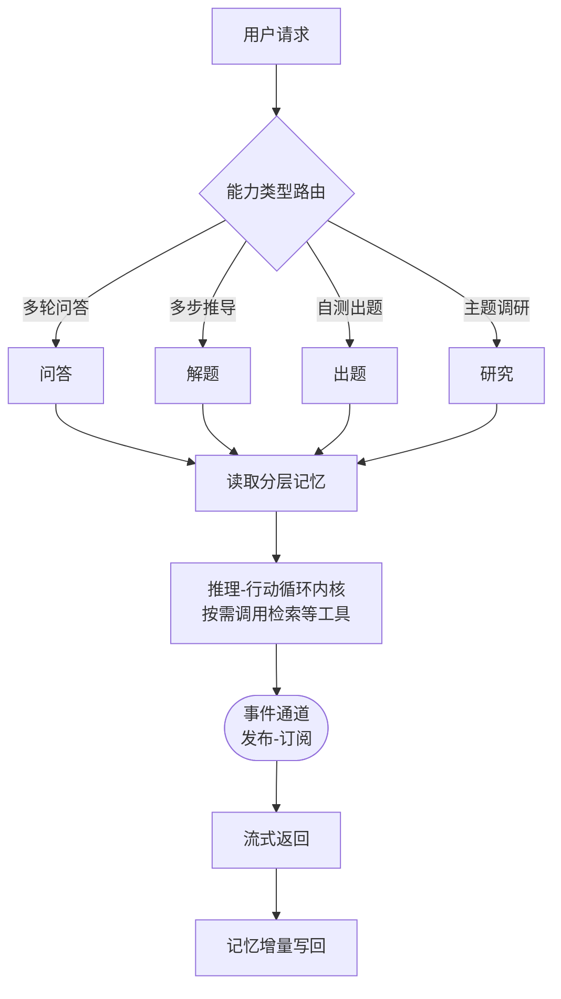
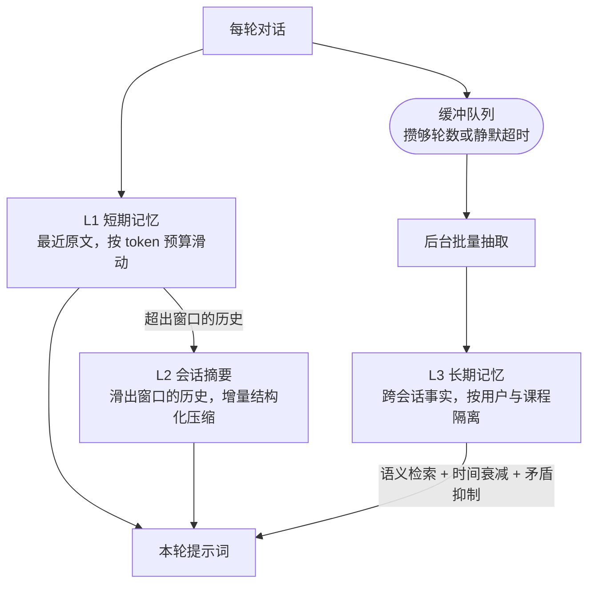

# 面向教学的课程助手智能体设计与实现

——以《电路分析基础实验》课程为例

**Design and Implementation of a Course-Specific Agent for Experimental Teaching: A Case Study of Fundamentals of Circuit Analysis Laboratory**

> 作者：×××，×××，×××（姓名、单位、邮编待补）
> 基金项目：×××（如有，待补）
> 通信作者：×××，E-mail: ×××
> 中图分类号：TP391；G642.423　　文献标识码：A

---

## 摘要

针对电路基础实验课程中理论与操作脱节、课堂答疑高度集中、学习过程缺乏个性化指导以及学习记录等问题，设计并实现了一个课程助手智能体系统。教师通过管理侧上传该课程知识库，学生通过课程码加入相应课程实现对该门课程的针对性学习。该系统以基于工具调用的推理—行动循环作为统一调度内核，将问答、解题、出题、深度研究四种能力构建在同一执行内核之上，满足学生的各类辅导需求。同时支持逐字流式渲染与中途取消、追加输入、断线续传等。索引子系统根据教师上传课程讲义的版面特点，采用标题层级栈驱动的结构化切分方式，并配合拼接上下文摘要来减少语境损失；该层提供知识图谱与向量索引两种后端并可按不同知识库独立选型。课程智能体的上下文治理方面，系统按跨请求稳定性对提示词分层以提高LLM前缀缓存命中率，并构造有效上下文窗口实现问答轮前规划与轮内优先级驱逐算法来保证每次回答的精准性与可靠性；记忆子系统为每名学生提供分层的个性化记忆，按遗忘边界与更新代价划分为三层，分别采用了滑动窗口、增量结构化压缩以及后台批量沉淀策略，保证了智能体的短期，中期，长期记忆的稳定性。所述设计已在《电路分析基础实验》课程上完成实现与部署，可为同类课程助手类智能体建设提供工程参考。

**关键词**：实验教学；课程智能体；检索增强生成；结构化切分；混合检索；上下文管理

**Abstract**: To address three problems commonly observed in fundamental electrical laboratory courses—the gap between theory and hands-on operation, the concentration of question answering during limited lab hours, and the absence of a continuous record of the learning process—a course-specific agent for a single laboratory course is designed and implemented. ... （英文摘要待与中文定稿后同步翻译，不少于 100 词）

**Keywords**: experimental teaching; course-specific agent; retrieval-augmented generation; structure-aware chunking; hybrid retrieval; context management

---

## 0　引言

随着大语言模型不断飞速发展，基于其而构建的学习系统也开始进入高校教学环节，"课程助教"类系统已从概念验证阶段进入到工程落地阶段。就现有公开数据，这类系统大致沿两条技术路线展开。

一是**参数微调路线**。陶飞飞等[1]以《操作系统原理》课程为实验对象，采用低秩适配方法微调开源模型，并利用大语言模型通过自动问答的方式构造了约七千条课程指令数据集用于训练；张友衡等[2]针对《编译原理》课程实验，同样以微调开源模型为主要手段。该路线的优势在于模型输出风格与课程内容高度贴合，代价是若课件或课程内容发生大的变化或需要更新内容，则需要重新构造数据并重新训练，单课程的边际成本较高，且模型内部知识与课程资料之间缺乏显式的对应关系，无法实现如"知识点或结论出自哪一页讲义"这类可追溯性要求。

另一条路线是**检索增强生成路线**。张立军等[3]为《计算机网络》实验课程构建了二十万字规模的知识库，采用稀疏检索与稠密检索双路召回后做倒数排名融合，并设置多级规范性检测用于拒答，并取得了较好的结果；潘宗耀等[4]则将知识图谱与文本向量并置为双路知识体系，按实验阶段设计不同的提示模板；张希坤等[5]进一步引入智能体框架，将前端交互、智能体调度、混合知识库与日志分析分层组织，并在实验班中开展了对照观察。

跨学科的同类工作亦呈现相近取向。文献[6]面向大学物理实验建设了教学辅助智能体并开展了准实验对比，文献[7]将大模型用于数字系统实践课程的代码分析与自动评分，文献[8]则提出在缺乏学生反馈的条件下评估检索增强型学习助手的方法框架，主张以历史提问自动构造测试集并结合专家校验，为"以离线评测替代课堂实证"提供了方法论依据。文献[9]将模型上下文协议引入智能导学系统的多智能体编排，说明协议化的工具接入正在成为该类系统的组织方式之一。此外，也有工作直接在低代码智能体平台上搭建电路课程学伴[10]，其局限在于解析、切分、检索、拒答等关键环节不可控，难以针对课程特点做定向优化，亦无法开展控制变量的对照分析。

综合来看，现有研究已在单个功能层面较为完备，但在工程的技术细节以及系统的AI化程度上尚存在薄弱环节。多数工作将检索增强生成作为一个整体模块进行引述，而对于对最终检索效果有重大影响的因素如：讲义或课程知识的文档如何进行解析以及相应的切块策略，多路的检索结果如何进行融合，证据不足时如何判定并拒答。这些细节恰恰决定了系统能否真正被学生所接受。 要想实现真正意义上的智能化课程助教，不仅仅是简单的一问一答式，而是需要准确感知学生的当前知识水平，学生的历史学习情况与学习偏好等，除了单独的课程内容之外，教学智能体还需要通过判断进行其他工具的调用如相关知识的联网查询补充等。

针对上述问题，本文以《电路分析基础实验》为案例课程，设计并实现了一个课程助手智能体系统，主要工作包括四个方面：

（1）实现了以大语言模型为核心的智能体，其能够自动进行多轮多种工具调用，能够维持上下文记忆以及每个学生不同的学习进度以及特点，并且能够实现基础问答、解题、出题、研究等多种教学模式。

（2）针对本课程实验讲义的版面特点设计了结构化解析与切分方案，以标题层级栈约束切分边界、将表格作为整体单元保留，并以上下文摘要前缀补偿细粒度切分的语境损失；

（3）设计了按知识库独立选型的双索引后端与相应的检索机制，：pgvector 路实现稠密与稀疏两路进行倒排索引算法融合与交叉编码器精排，经 RRF 融合与 Cross-Encoder 精排实现高召回事实检索；LightRAG 路构建课程级知识图谱，对于关系/多跳查询采用图谱邻域扩展与向量召回的双路拼接检索；均以三层门控实现证据不足时的显式拒答（无命中判定与工具层拒答为常开层，相关性阈值层默认关闭、需开启精排并标定后启用）；

（4）设计了面向长时间交互的上下文预算治理与三层学习记忆机制，设计了按跨请求稳定性分层的提示词框架，并以有效上下文窗口实施回合前预算规划与轮内按优先级掩码遮蔽算法。

---

## 1　教学需求分析

《电路分析基础实验》是电类专业的核心基础实验课程，课程内容覆盖欧姆定律、基尔霍夫电流与电压定律、叠加定理、戴维南与诺顿等效、一阶电路暂态响应等知识点，要求学生既理解定律与等效变换的理论表述，又能完成接线、测量、记录与误差分析等操作环节。结合课程教学实际，系统建设面向三个具体问题。

**问题一：理论表述与实验步骤之间缺乏可操作的中间层。** 学生在课堂上能够复述定理内容，但在实验台前往往不清楚测量顺序、不理解某一步骤的目的，测量结果与理论值不符时缺乏排查思路，最终表现为跟做实验、报告模板化。系统需要能够针对具体实验任务给出分步推导与操作提示，而非仅复述教材定义。

**问题二：实验课时内答疑请求高度集中。** 实验课通常多组学生同时进行，同一时段内的提问在时间上高度集中且在内容上高度重复。基础较弱的学生反复卡在同类问题上，基础较好的学生希望获得更深入的推导，仅靠教师现场巡回难以兼顾。系统需要承接共性问题的即时应答，使教师的时间可以投向关键问题诊断。

**问题三：学习过程缺乏跨阶段的连续记录。** 学生在预习、实验、复盘三个阶段的提问与易错点分散在不同媒介中，既无法在后续交互中被复用，也难以为教师的分层指导提供依据。系统需要在会话内与跨会话两个尺度上沉淀学习轨迹，并在后续回答中体现。

由上述问题导出四项设计目标：回答须可追溯到课程资料中的具体片段；课程资料未覆盖时须明确拒答而非以通用知识强答；交互过程须可视、可中断，以适配实验课堂的即时反馈节奏；系统须能够在无图形处理器的低配服务器上长期运行，以匹配院系实验室的部署条件。

---

## 2　系统总体架构

系统采用前后端分离架构，前端基于 React 与 TypeScript 实现课程选择、会话管理与流式渲染，后端基于 FastAPI 实现接口层与调度层，以 PostgreSQL 承载业务数据与向量数据、以 Redis 承载缓存与任务队列。

总体处理流程如图 1 所示。用户请求进入后，调度层先按前端指定的能力类型完成路由，随后统一进入共享的推理—行动循环内核；内核执行过程中读取该用户的分层记忆作为上下文补充，按需调用课程知识库检索、联网搜索等工具，执行结束后将本轮交互的增量信息写回记忆存储。

**图 1　系统总体架构与请求处理流程**

四类能力的差异仅体现在各自配置的工具集合与阶段划分上：问答为单次循环；解题在单次循环之上叠加独立于模型推理的计划状态机，强制"先规划、再执行、不可跳步"；出题拆分为素材检索、蓝图规划、题目并行生成三个阶段；研究拆分为主题澄清、子问题分解、并行取证、报告生成四个阶段。这一组织方式的直接收益是内核层的可靠性改进（超时处理、异常兜底、上下文预算治理、成本记账）对四类能力同时生效，避免维护多套重复的编排逻辑。

与以显式状态图定义流程走向的图编排框架相比，本系统的流程控制通过代码编排与轮次上限实现，未引入独立的图运行时。在当前能力规模下，这一取舍在保证核心逻辑可追溯、可单元测试的前提下降低了实现与调试复杂度。

---

## 二、四大功能

系统面向用户提供四类功能入口，由前端指定：

| 功能 | 定位                                                     | 执行方式                                                   |
| ---- | -------------------------------------------------------- | ---------------------------------------------------------- |
| 问答 | 面向课程内容的多轮交互问答，回答优先基于检索到的课程资料 | 单次循环执行，提炼出用户关键词按需调用检索、联网搜索等工具 |
| 解题 | 面向需要多步骤推导的问题，要求先给出完整计划再逐步执行   | 单次循环配合专门的计划状态记录机制                         |
| 出题 | 按要求自动生成练习题目                                   | 分阶段执行：素材检索、出题蓝图规划、题目并行生成           |
| 研究 | 面向指定主题的深入调研，产出附带引用来源的报告           | 分阶段执行：主题澄清、子问题拆分、并行检索取证、报告生成   |

四类功能均建立在同一套调度内核之上，区别在于任务编排方式：问答任务采用单次循环即可完成；解题任务在单次循环基础上引入了额外的状态记录机制，用于约束"先规划、再执行、不可跳步"的过程；出题与研究任务则将任务拆分为多个阶段，每个阶段分别执行一次或多次循环，再将各阶段结果整合为最终输出。

### 2.1 解题任务

解题任务的可靠性依赖于一个独立于模型推理的状态记录机制：模型必须先完整给出解题计划，计划确认后按步骤逐一推进，每完成一步才能进入下一步；若执行中出现偏差，允许重新规划，但重新规划的次数受到上限约束。这一设计将"计划完整性"与"不可跳步"两项要求实现为可验证的执行约束，而非仅依赖提示词层面的建议，可靠性更高，也具备可测试性。

### 2.2 出题任务

出题任务采用三阶段流程：首先从课程资料中检索相关内容，其次生成出题蓝图（确定题目数量与各题的题型），最后按蓝图并行生成各道题目。将"确定蓝图"与"逐题生成"分离，并允许题目之间并行处理，能够避免生成过程中出现题型与数量偏离蓝图的情况，同时降低整体生成耗时；单道题目生成失败也不会影响其余题目的正常产出。

### 2.3 研究任务

研究任务采用四阶段流程：主题澄清、子问题拆分、并行检索取证、报告撰写，各阶段的行为规范通过提示词工程分别约束，提示词与代码分离、可独立调整。子问题之间的检索过程相互独立，可并行执行；每一条纳入报告的结论都要求关联具体的检索来源，最终报告以编号形式标注引用出处，保证结论可追溯，避免出现缺乏依据的论断。

---

## 

## 3　关键技术设计

### 3.1　多能力共享的调度内核与执行—传输解耦

调度内核采用以工具调用驱动的推理—行动循环[11]：模型在每一轮自主判断是否需要调用工具，需要则执行调用并观测结果，据此决定继续调用还是给出最终回答；模型不再发起工具调用时循环结束。

内核对外只产出与传输方式无关的事件（阶段起止、模型增量输出、工具调用状态、最终答案），经发布—订阅式事件通道与协议入口连接。该异步机制带来两点收益：其一，模型推理与事件下发并行推进，是实现首字延迟最短与逐字增量渲染的前提；其二，当内核产出速度与某一消费端的网络或渲染速度不一致时，事件在通道中排队即可，不会阻塞内核执行。目前同一套事件流由两类入口消费：网页问答入口采用 HTTP 单向流式响应，追求最短首字延迟，并以独立旁路支持用户中断工具循环、立即作答；出题与研究共用的深度能力入口采用 WebSocket 全双工协议，在同一连接上支持澄清反问的实时交互、任务取消、追加输入与断线后按事件序号续传。

### 3.2　面向实验讲义的结构化解析与切分

本课程实验讲义文档的版面特征是：章节层级明确、存在大量表格承载关键参数（元件规格、量程设置、测量记录格式）等、图文混排比例较高。早期实现按固定字数机械切分，不感知标题层级与表格结构，导致大段表格被从中间截断、片段脱离所属章节语境。

改进后的方案由三部分构成。首先，解析层将 PDF、DOCX、PPTX 等不同格式的数据统一转换为带章节层级与页码元数据的结构化中间层表示（markdown），其中 PDF 文件引入版面分析与表格结构识别以替代按页面顺序提取文本的做法[17]，并按解析产物中的标题层级完成分节—解析只负责还原结构不涉及切分。其次，切分层引入标题层级栈，以文档自身的章节层级约束切分边界，并将表格作为独立单元整体保留，避免跨行截断；层级感知切分相较于固定字数切块对检索的准确度有可观提升[16]。文档中被识别到的图片部分采用vllm进行描述并拼入chunk。最后，切分粒度由固定较大值调整为更小的可配置参数，同时为每个片段补充上下文摘要，说明该片段在原文中的位置与背景，以补偿粒度变小带来的语境损失。

### 3.3　双索引后端与检索路由

对于课程相关内容的检索，存在着不同的需求。部分问题需要跨知识点的关系推理（如"戴维南定理与诺顿定理之间有何联系"），而另一些问题只需要定位某一知识点的原文表述（如"实验三中电流表的量程如何设置"）。两类需求对应着不同的索引构建方式，对索引构建成本与检索能力的要求不同，单一方案难以同时满足，因此系统允许每个知识库选择多种索引后端，二者对比见表 1。

**表 1　两种索引后端的特性对比**

| 维度 | 知识图谱索引 | 向量索引 |
|---|---|---|
| 索引原理 | 逐文本块调用大模型抽取实体与关系并建图 | 复用已切分文本块，仅做向量编码 |
| 构建耗时 | 随语料规模近似线性增长，大规模课件需数小时 | 分钟级，可批量并发 |
| 检索能力 | 图谱邻域扩展结合向量检索，支持多跳关系推理[12] | 稠密与稀疏并行召回后融合，面向精确事实检索 |
| 适用场景 | 需跨材料综合推理的课程 | 课件规模大、以事实定位为主的课程 |

向量存储选用关系数据库的向量扩展而非独立的专用向量数据库。依据有二：其一，其近似最近邻搜索算法[14]在本项目的向量规模内性能已经足够；其二，索引数据与业务数据统一存储，若引入额外的向量数据库则会不可避免地增加额外的运维成本和硬件资源——这一权衡更贴合院系实验室的部署条件。

检索数据的**模式**可由用户指定，可走图谱增强检索与向量检索。

### 3.4　混合检索、排名融合与交叉编码器精排

稠密检索即把用户的提问和文档数据均嵌入为向量，用HNSW算法做余弦相似度检索，能够查询到语义相近但是措辞不同的相关数据，而稀疏检索对器件型号、编号、专有名词等精确词汇的召回更可靠，二者互补。系统对两路分别独立查询后做倒数排名融合（RRF）[13]：使得两路返回的不同量纲的结果能够根据其各自的排名位置计算融合得分。由于两路面向同一存储表，片段标识天然一致，融合无需额外的跨存储对齐步骤。多路召回解决的是不漏相关信息，融合解决的是初步排序。但 RRF 仍基于各路召回器的独立打分，对 query–document 的细粒度交互建模有限。而Cross-Encoder 把 query 和每个候选 doc 一起送进模型，输出相关性分数。相关组件消融论文表明，Cross-Encoder 精排在多阶段流水线中能带来统计显著的质量提升（HotpotQA 数据集上 p<0.001），且延迟开销可忽略。[21]。

### 3.6　上下文预算治理与KV cache友好的提示词分层设计

由大语言模型的工作原理，在注意力机制中，每生成一个新词，它的Query都要与前面**所有**词的 Key 做匹配，再用所有词的 Value 加权求和。如果每次都从头计算所有 K 和 V，计算量会随上下文长度不断增长。KV Cache 就是把已算过的 K 和 V 缓存起来，让新词直接复用。若能充分利用好这个特性，对于模型的推理速度和token消耗都能得到可观改善。多轮工具调用会使消息列表迅速膨胀，而一般模型真正有效的上下文窗口显著小于其标称值，当重要线索在最前面或最后面时，模型能轻松找到并利用相关信息，但对于中间关键信息的提取和理解能力大幅下降，即“Lost in the middle”现象[20]。基于此，本系统实现以下设计。

**提示词分层。** 系统提示词由执行规范、课程配置、技能说明、工具提示、跨会话记忆、会话摘要等若干来源拼接而成，拼接顺序按照提示词的"跨请求的稳定程度"从高到低排列：全局恒定的在最前，课程级与用户级配置次之，每次请求都可能变化的记忆与时间放在最后从而最大成大利用kv cache。

**回合与轮内预算。** 首先设计安全线与质量线：安全线由模型标称窗口扣除输出预留与安全余量得到，是在触及模型超界后拒绝回答的边界，质量线显著低于安全线，越过它便启动自动压缩。这一设计考虑到了在长上下文基准下，模型的有效长度通常仅为其标称值的 25%–50%[26]，同时也避免使用固定窗口值使得长窗口模型的容量优势被浪费；[27]。一轮问答开始前依据质量线规划历史消息：未超阈值时不作裁剪，超出且存在会话摘要时裁切为质量线的一半，否则裁切到质量线。之后进入到轮内问答部分，若超出质量线，在每次模型调用前按代价递增级联式降低预算：先将更早轮次的工具结果按优先级清理为掩码标记（保留最近若干轮不动，携带来源引用段的检索结果优先级更高），该方法以十余字的掩码替换数千字的原始工具输出，可在不丢失对话语义的前提下显著降低预算。相对于整段摘要压缩，清理旧观测的成本收益更优且不易引发任务轮数变长[25]。若经 L1 清理后仍超质量线则追加一次 LLM 调用把被清内容折叠为摘要块；若某次问答返回大量信息导致直接超出安全线，经 L1/L2 处理后仍超出安全线则丢弃最旧部分消息以保证请求可送达。

### 3.7　三层学习记忆

记忆系统按遗忘边界与更新方式的不同划分为三层（图 2）。

**图 2　三层学习记忆的写入与读取路径**

**L1 短期记忆**根据当前模型的上下文容量换算出 token 预算，从最新消息向前逐条累加直至超出预算窗口进行截断，窗口长度根据所选模型的不同而自适应调整；token 计数优先使用分词器精确统计。

**L2 会话摘要**采用滑动窗口机制。在消息量超出窗口一定量后触发，用于在原文滑出窗口后保留之前的关键信息。压缩以增量方式进行：维护一个按时间戳与消息标识复合排序的游标，记录已压缩到的消息位置，每轮只处理游标之后、窗口边界之前新增的这一小段历史，不重复扫描或重新处理已压缩过的部分。每次做摘要时只让大模型从新增的历史片段中按预定义结构（讨论主题、已达成结论、确认的事实、未解决问题、后续约定）抽取信息、输出为结构化数据，最终由代码逻辑将新抽取结果与已有摘要做归一化去重合并，每类信息按条数上限保留最近若干项、超出上限时丢弃最旧的一项；工程上按会话加锁并在写回时做乐观并发控制，防止同一会话被并发触发导致游标错乱。分层摘要与选择性注入的思路参考了树形摘要检索与压缩式检索增强的相关工作[23]。

**L3 长期记忆**实现了跨会话保留关于学生的事实性片段（学习偏好、个人特点、薄弱知识点等）。长期记忆通过沉淀链路实现，先写入按用户会话分桶的缓冲队列，交由后台任务在累积importance点数达阈值或静默超时后批量处理。由Secom的研究可知个性化agent的记忆保存粒度分段保存由于每轮保存[24]，检索链路在语义检索之外又叠加了矛盾抑制，对文本相似度超阈值且写入时间相隔超过最小天数的两条记忆判定为同一事实的前后版本，注入时只保留较新一条，该判定基于字符串相似度完成，不额外消耗模型调用。记忆分层的总体思路借鉴了memgpt将上下文窗口类比为分级存储的设计架构[19]，差异在于本系统的层间流转由确定性规则触发而非交由模型自主决定，以换取行为的可测试性。

### 3.8　skills与mcp的渐进式披露

本系统集成了skills模块，每位学生均添加属于自己的skills。随着可用工具与课程技能的增多，若将全部工具描述常驻于系统提示中，上下文长度将随skills数量线性增长，且大部分描述在单次会话中并不会被使用。故系统采用渐进式披露：系统提示词中默认只提供技能的简要描述与工具名称提示，当模型判断需要调用某项能力时再显式再显式加载完整说明；除内置工具外，系统还通过模型上下文协议（MCP）接入外部工具，由网关进程统一维持连接，由管理员侧统一部署，学生侧可按需选择性开启。通过模型上下文协议接入的外部工具则使用相同的策略，系统提示中仅写入分组后的扩展工具名称与简短描述，通过系统内置load_tool工具进行按需调用。协议化mcp工具便于后续系统能力的拓展，比如接入仿真，检索，计算等外部能力接口。同类研究也证明导学系统正走向协议化，模块化，而不再仅限于单体的利用提示词实现功能[9]。

---

## 4　系统实现与部署

系统以容器编排方式部署，常驻五个服务：数据库（含向量扩展）、缓存与任务队列、Web 服务进程组、后台任务进程、前端静态服务。大模型推理与向量编码全部经外部服务商接口完成，本地不做任何模型部署；以尽可能少的资源完成服务的部署，符合院系实验室的常规资源条件。

工程健壮性方面实现了三项机制。

**分布式互斥。** 服务以多进程方式部署，单进程内的互斥锁无法防止跨进程并发。系统按场景特征分别设计：知识库索引构建可能持续数小时，采用带存活时间的分布式锁并由独立任务在到期前主动续约，持有者异常退出后锁自动释放，锁粒度按"知识库＋索引后端"划分，使同一知识库的两种索引可并行构建；记忆的后台批量写入耗时极短，采用短存活期锁且不引入续约机制；

**异步任务与失败留痕。** 知识库构建等长耗时任务交由后台队列执行，不占用用户请求链路；任务失败后自动重试固定次数以吸收可恢复故障，重试仍失败者不被静默丢弃，而是写入专门的失败清单并保留数日供人工排查或重放。索引类任务被设计为可重复执行且结果一致，因此自动重试不会产生重复数据。

**可观测性与成本记账。** 系统接入全链路追踪，并在接口层与业务层分别埋点，以统一前缀定义整轮耗时、首字响应延迟、工具调用成功率、token 用量与成本、连接池水位等指标，以标准文本格式经指标端点暴露，可直接接入通用监控平台做聚合与告警。每一轮循环的 token 用量在调度内核这一唯一出口处采集，既计入指标，也按用户、课程、会话维度落库，用于按人按课查询用量；当日累计成本超出预算时，系统降级到更低成本的模型档位而非直接拒绝服务，以避免"上一轮刚好超限、下一轮被完全锁死"的可用性问题。

---

## 5　评测方案（本节待补）

> 说明：本节为占位。评测工作尚在进行中，定稿时按以下口径补充，不预先写入任何未产出的数据。

评测将基于检索增强生成的自动评测框架[18]开展，并针对本场景做三点定制：其一，将证据获取与回答生成拆分为两个独立步骤采集，避免回答内容反向影响忠实度指标的有效性；其二，指标按检索层、生成层、鲁棒性与领域定制层分级组织，其中教学表述准确性与实验安全提示为教学场景专设指标；其三，评测集由人工编写的电路实验题构成，按认知维度划分为事实类、关联类、推理类、比较类，用于区分系统在不同认知复杂度问题上的表现差异。评测流程设置质量门禁阈值，用于在后续迭代中及时发现检索质量退化。

需要说明的是，本文的效果验证限于离线评测，不含课堂实证数据。既有工作已论证：在缺乏学生反馈的条件下，以历史提问自动构造测试集并结合专家校验的离线评估方案，可以作为该类学习助手的有效评估路径[8]。全文统一使用"评测""验证"表述，与"教学应用效果"严格区分。

---

## 6　结论与展望

本文以《电路分析基础实验》为案例课程，设计并实现了一个课程学习助手智能体系统。该系统支持任意课程的教学问答，教师通过上传课件等材料建立课程知识库，学生侧通过课程码加入相应课程，即可进行该门课程的学习问答流程。系统以推理—行动循环(ReAct)为统一调度内核承载问答、解题、出题、研究四类能力，支持实时流式渲染与全双工交互；检索子系统针对课程课件的版面特点实现了结构化解析与精准切分、实现了双索引后端可灵活选型，并以三层门控实现证据不足时的显式拒答（无命中判定与工具层拒答常开，相关性阈值层默认关闭、需开启精排并标定后启用）；上下文管理与三层学习记忆机制则面向交互中的成本与个性化需求。

后续工作从三个方向推进。其一，完成切分粒度的系统性消融与双索引后端在同一评测集上的对比验证，当前粒度取值来自首轮实验的候选值，尚需与其他候选值系统对比。其二，针对推理类问题的多跳检索能力开展专项改进，该类问题需要跨越多个知识点串联因果链条，是当前检索策略的能力边界所在。其三，开展课堂准实验验证，拟采用对照组与实验组设计，以预习成绩、实验操作错误率、任务完成时间与实验报告质量为观测指标，在同一任课教师、同一实验项目条件下开展一学期的对比观察，并同步采集系统侧的会话日志与拒答率，用于交叉验证离线评测结论与真实教学效果的一致性。

---

## 参考文献

[1] 陶飞飞, 张优优, 邓劲柏, 等. 基于大语言模型的"操作系统原理"实验教学辅助系统[J]. 实验技术与管理, 2026, 43(2): 212-218.

[2] 张友衡, 熊莹, 周放, 等. 基于微调 StarCoder2 大模型的"编译原理"课程实验系统[J]. 实验技术与管理, 2025, 42(4): 227-232.

[3] 张力军, 刘偲, 廖纪童, 等. 基于大模型检索增强生成的计算机网络实验课程问答系统设计与实现[J]. 实验技术与管理, 2024, 41(12): 186-192.

[4] 潘耀宗, 刘凯, 于柯远, 等. 基于检索增强生成的计算机实验指导平台设计与实践[J]. 实验技术与管理, 2025, 42(4): 213-219.

[5] AI Agent 驱动的实验自主学习与故障诊断能力培养系统[J]. 实验技术与管理, 2026, 43(4).（作者信息待补）

[6] 潘芊何, 汤长烁, 邱智鑫, 等. 大学物理实验教学辅助 AI 智能体的建设与实践[J]. 大学物理, 2026, 45(3): 85.

[7] 基于 AI 技术的数字系统实践课程教改应用[J]. 电气电子教学学报, 2025(S1): 166-171.（作者信息待补）

[8] HUA C, et al. Proactive framework for evaluating retrieval-augmented generation-based learning assistants in engineering education[J]. Computer-Aided Civil and Infrastructure Engineering, 2025.

[9] Leveraging RAG with ACP & MCP for adaptive intelligent tutoring[J]. Applied Sciences, 2025, 15(21): 11443.（作者信息待补）

[10] 王子健, 张梦达, 赵伟强, 等. 《电路智导》AI 学伴的创建研究[J]. 人工智能与机器人研究, 2026, 15(1): 76-86.

[11] YAO S, ZHAO J, YU D, et al. ReAct: synergizing reasoning and acting in language models[C]//International Conference on Learning Representations (ICLR), 2023.

[12] EDGE D, TRINH H, CHENG N, et al. From local to global: a graph RAG approach to query-focused summarization[EB/OL]. arXiv:2404.16130, 2024.

[13] CORMACK G V, CLARKE C L A, BUETTCHER S. Reciprocal rank fusion outperforms condorcet and individual rank learning methods[C]//SIGIR, 2009: 758-759.

[14] MALKOV Y A, YASHUNIN D A. Efficient and robust approximate nearest neighbor search using hierarchical navigable small world graphs[J]. IEEE Transactions on Pattern Analysis and Machine Intelligence, 2020, 42(4): 824-836.

[15] Anthropic. Introducing contextual retrieval[R/OL]. Technical Report, 2024.

[16] MultiDocFusion: hierarchy-aware chunking for multi-document retrieval[C]//EMNLP, 2025.（arXiv:2604.12352，作者信息待补）

[17] Docling: an efficient open-source toolkit for AI-driven document conversion[EB/OL]. arXiv:2408.09869, 2024.

[18] ES S, JAMES J, ESPINOSA-ANKE L, et al. RAGAS: automated evaluation of retrieval augmented generation[EB/OL]. arXiv:2309.15217, 2023.

[19] PACKER C, WOODERS M, LIN K, et al. MemGPT: towards LLMs as operating systems[EB/OL]. arXiv:2310.08560, 2023.

[20] LIU N F, LIN K, HEWITT J, et al. Lost in the middle: how language models use long contexts[J]. Transactions of the Association for Computational Linguistics, 2024, 12: 157-173.

[21] Dissecting agentic RAG: A Component Ablation for Multi-Hop QA with a Local 7B Model[EB/OL]. arXiv:2606.21553, 2026.（作者信息待补）

[22] Investigating the role of RAG noise in large language models[C]//ACL, 2025.（arXiv:2408.13533，作者信息待补）

[23] SARTHI P, ABDULLAH S, TULI A, et al. RAPTOR: recursive abstractive processing for tree-organized retrieval[C]//ICLR, 2024.

[24] SeCom: on memory construction and retrieval for personalized conversational agents[C]//ICLR, 2025.（arXiv:2502.05589，作者信息待补）

[25] LINDENBAUER T, et al. The complexity trap: simple observation masking is as efficient as LLM summarization for agent context management[C]//NeurIPS DL4Code Workshop, 2025.（arXiv:2508.21433）

[26] Hsieh C-P, Sun S, Kriman S, et al. RULER: What's the Real Context Size of Your Long-Context Language Models? arXiv preprint arXiv:2404.06654, 2024.

[27] Anthropic. Context editing [EB/OL]. https://platform.claude.com/docs/en/build-with-claude/context-editing

## 

